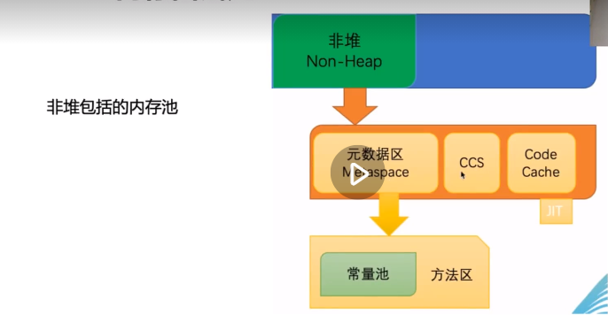

### 内存性能指标  
可以从哪些维度来划分性能指标？  
1. 容量  
- 系统内存总量（物理内存）  
- 系统空闲内存  
- JVM 内存使用量  
- 堆内存使用量（最大/当前）  
- 堆内存最大值（-Xmx）  
2. 吞吐量  
- 内存分配速率  
- 内存提升速率  
3. 延迟（Latency）  
- GC 暂停时间--即：STW  
- 内存分配延迟  
- 主频（物理内存）  
- CL 延迟（物理内存）  

### 常用监控系统  
三要素：  
1. 指标采集客户端  
2. 服务端/存储--eg:  
    - Micrometer（参考阅读：https://www.cnblogs.com/cjsblog/p/11556029.html）  
    - 云服务监控系统  
    - 开源监控系统  
3. 可视化系统  

> eg:  
> Datadog、听云、OneAPM(蓝海讯通)、AppOptics、Dynatrace、Humio、Instana、
> Instana、New Relic、SignalFx、Stack Driver、Wavefront、Plumbr、OverOps  
>   
> Prometheus+Grafana、Pinpoint、StatsD、ELK(ElasticSearch)、Atlas、
> InfluxDB、Ganglia、Graphite、KairosDB  
> 

  
ps：图中 ccs 为 Compressed Class Space

### 面试题：  
1. G1 垃圾收集器的混合模式 GC 是什么？
- 纯年轻代模式  
- 混合模式  
- FullGC  

2. 生成内存转储文件有哪几种方式？用什么工具进行分析？  
- jmap/jcmd-堆  
    - jstack--栈  
- JVisualVM/JMC/jconsole  
- 自动执行堆内存转储：-XX:+HeapDumpOnOutOfMemoryError -XX:HeapDumpPath=<file-or-path>  
- JMX 客户端工具  
- 编程方式调用：HotSpotDiagnosticMXBean  

工具：
- JMX  
- MAT（Memory Analyzer tool）--一种快速的、功能丰富的Java堆分析工具，用于帮助查询内粗泄漏和减少内存消耗。  
  >（参考阅读：https://www.jianshu.com/p/97251691af88）  
- HAT
  >（参考阅读：https://access.redhat.com/documentation/zh-cn/red_hat_enterprise_linux/7/html/performance_tuning_guide/chap-red_hat_enterprise_linux-performance_tuning_guide-performance_monitoring_tools）  

4. 请结合你的经验，谈谈怎样解决 GC 停顿问题？  
- GC 算法  
- 配置参数  
- 硬件资源  
- 程序代码  
- 系统架构  

