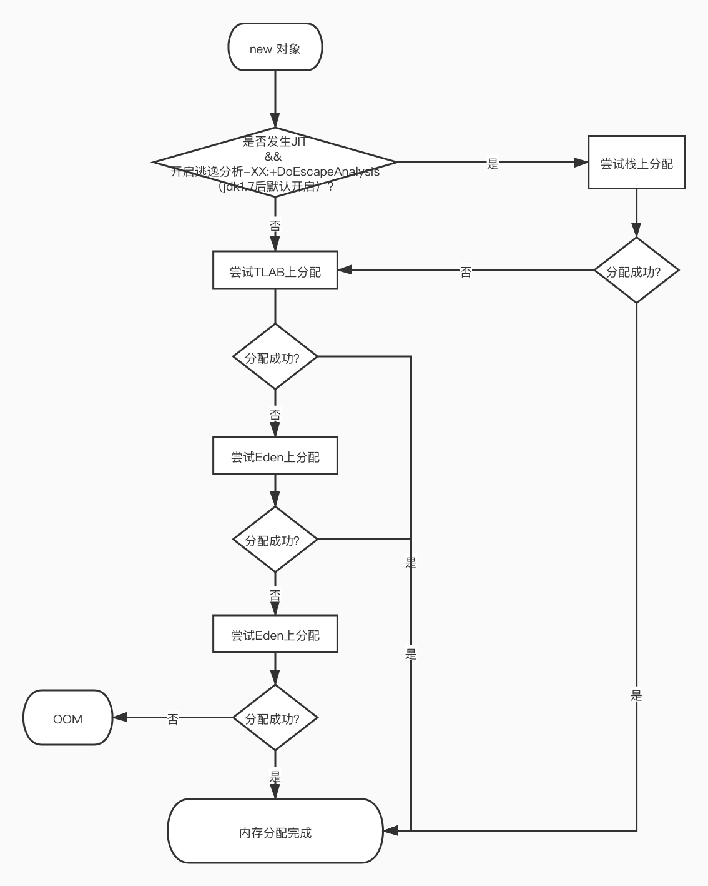

Java中new出来的对象不一定在堆上，还有可能分配在栈上甚至寄存器上，这就涉及JIT时的逃逸分析。

做逃逸分析的目的是尽可能避免将对象分配到堆中。  
做TLAB分配到目的是，即使不得不将对象分配到堆中，那也要尽量避免堆内存分配时对堆加锁。（ps：堆是线程公用堆，所以在分配堆空间时要加锁，而TLAB是Eden区上分配给指定线程堆独享的一小块空间，故没有锁开销）。而无锁加上指针碰撞分配技术可以实现对象的快速创建。  

### 一、逃逸分析
当变量（或者对象）在方法中分配后，其指针（或引用）有可能被方法返回或被全局引用，从而导致其被其它过程或线程引用对现象被称为指针（或引用）对逃逸。  
逃逸分析后对象的三种逃逸状态：  
- 全局逃逸 
- 参数级逃逸 
- 未逃逸  

编译器根据逃逸分析结果可做的优化：
1. 栈上分配
2. 同步（锁）消除：如果确定一个对象不会逃逸出线程，无法被其它线程访问到，那该对象的读写就不会存在竞争，对这个变量的同步措施就可以消除掉。
3. 标量替换：（如果逃逸分析证明一个对象不会被外部访问，并且这个对象是可分解的，那程序真正执行的时候将可能不创建这个对象，而改为直接创建它的若干个被这个方法使用到的成员变量来代替。拆散后的变量便可以被单独分析与优化，可以各自分别在栈帧或寄存器上分配空间，原本的对象就无需整体分配空间了。）  
    - 标量：Java虚拟机中的原始数据类型（int，long等数值类型以及reference类型等）都不能再进一步分解，它们就可以称为标量。
    - 聚合量：相对的，如果一个数据可以继续分解，那它称为聚合量，Java中最典型的聚合量是对象。

### 二、TLAB(Thread-Local Allocation Buffer)

### 三、Java对象分配流程

具体代码逻辑：  
1. 编译器通过逃逸分析，确定对象是在栈上分配还是在堆上分配。如果是在堆上分配，则进入选项2.  
2. 如果tlab_top + size <= tlab_end，则在在TLAB上直接分配对象并增加tlab_top 的值，如果现有的TLAB不足以存放当前对象则3.（这里还涉及一个refill_waste，具体可参看文底所附文档）  
3. 重新申请一个TLAB，并再次尝试存放当前对象。如果放不下，则4.
4. 在Eden区加锁（这个区是多线程共享的），如果eden_top + size <= eden_end则将对象存放在Eden区，增加eden_top 的值，如果Eden区不足以存放，则5.
5. 执行一次Young GC（minor collection）。
6. 经过Young GC之后，如果Eden区任然不足以存放当前对象，则直接分配到老年代。
7. 如果老年代也放不下，那没办法，只能OOM了。

### 分配对象内存的两种方法 
1. 指针碰撞（Bump the Pointer）方式：指针分割已用空间与可用空间  
   eg. 串行GC与并行GC在老年代采用的"标记-清除-整理"算法
2. 空闲列表（Free List）方式：虚拟机多维护一张列表，上面维护可用的内存块信息
   eg. CMS GC在老年代采用的"标记-清除"算法

附：GC的三种算法：  
1. 清除算法（标记-清除）
2. 复制算法（标记-复制）
3. 整理算法（标记-清除-整理）

以上仅做个梗概，具体可参看：https://www.yuque.com/mona432/oxsztl/ydbo6s/edit

