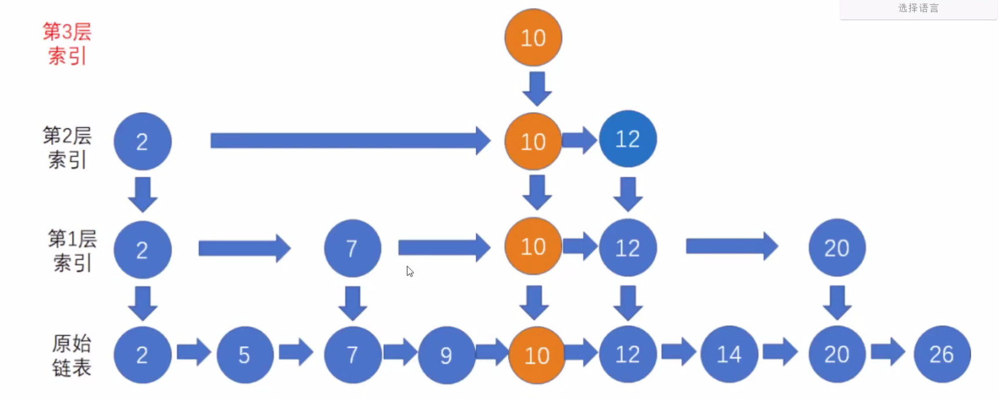
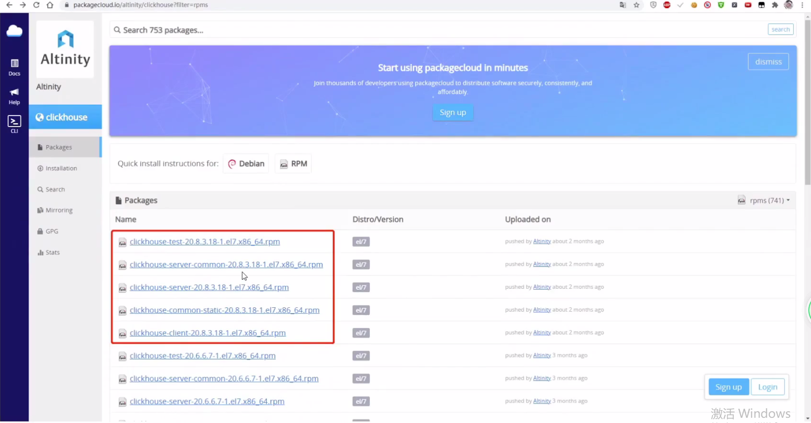
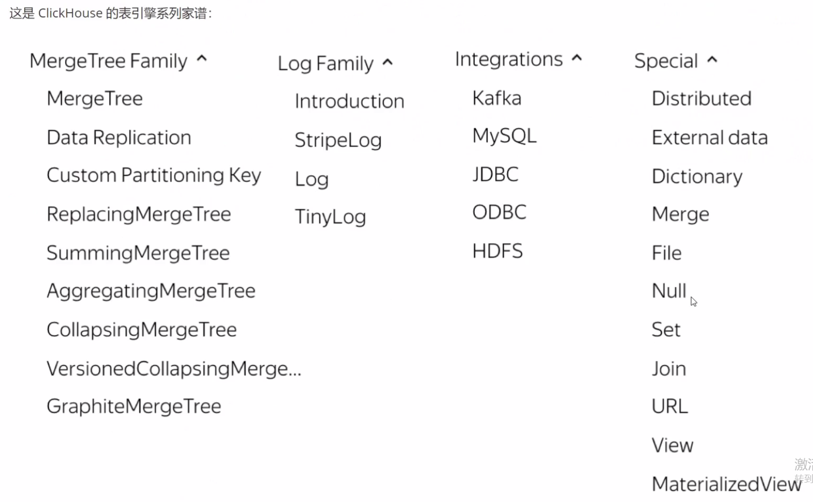

课程介绍：
LOAP 之 ClickHouse 和 Doris 谁与争锋？ ClickHouses 和 Doris 深度大 PK ？  
- 首次完整揭秘 ClickHouse 核心特性；  
- 彻底揭秘千亿级企业 ClickHouse 实时处理引擎架构设计核心技术设计、运行机理全流程；  
- 彻底揭秘千亿级企业 ClickHouse 在企业大数据业务场景下的应用实践；  
- Doris 源码核心作者揭秘 Doris 架构设计核心原理；  
- 首次全方位深度对比 ClickHouse 和 Doris 两大 OLAP 利器。

ClickHouse如何做查询分析那么快的原因原理分析。
先从探讨，一款高效的OLAP系统组件的核心技术应该有那些？然后，ClickHouse实现了哪些？
最终工作流程是什么？
- ClickHouse 全知全解  
- ClickHouse 设计思路和核心特性剖析  
- ClickHouse 表引擎详解  
- ClickHouse 工作原理（数据分区，一级索引，二级索引，数据压缩，数据标记，数据查询）  


### 一、ClickHouse 表引擎详解和架构原理  
#### 1.1 ClickHouse 设计思想和核心技术特征  
##### 1.1.2 ClickHouse 全知全解  
ClickHouse 是一个用于联机分析（OLAP）的列式数据库管理系统（DBMS）。  

来自于 2011 年在纳斯达克上市的俄罗斯本土搜索引擎企业 Yandex 公司，诞生之初就是为了服务
ata WareHouse。 

ClickHouse官网：http://clickhouse.tech/，它具有 ROLAP、在线实时查询、完整的 DBMS 功能支持、列式存储、
不需要任何数据预处理、支持批量更新、拥有非常完善的 SQL 支持和函数、支持高可用、不依赖 Hadoop 复杂生态、开箱即用等许多特点。  

在 1亿数据集体量的情况下，ClickHouse的平均响应速度是 Vertica 的 2.63 倍、 InfiniDB 的 17 倍、 MonetDB 的 27 倍、 Hive 的 126 倍、 Mysql 的 429 倍
以及 Greenplum 的 10 倍。 详细的测试结果可以查阅：https://clickhouse.tech/benchkmark/dbms/。  

ClickHouse 非常适用于商业智能领域（也就是我们所说的BI领域）， 除此之外， 它也能够被广泛应用于广告流量、 Web、 App流量、 
电信、 金融、 电子商务、 信息安全、 网络游戏、 物联网等众多其他领域。  

ClickHouse 是近年来备受关注的开源列式数据库， 主要用于数据分析（OLAP）领域。目前国内社区火热， 各个大厂纷纷跟进大规模使用：  
- 今日头条内部使用 ClickHouse 来做用户行为分析， 内部一共几千个 ClickHouse 节点， 单集群最大 1200 节点， 总数据量几十 PB， 日增原始数据 300TB 左右。  
- 腾讯内部用 ClickHouse 做游戏数据分析， 并且为之建立了一整套监控运维体系。  
- 携程内部从 18 年 7 月份开始接入试用， 目前 80% 的业务都跑在 ClickHouse 上。 每天数据增量十多亿， 近百万次查询请求。  
- 快手内部也在使用 ClickHouse， 存储总量大约 10PB， 每天新增 200TB， 90% 查询小于 3s。  

ClickHouse 缺点：  
> 没有完整的事务支持；  
> 稀疏索引， 导致 ClickHouse 不擅长细粒度或者 key-value 类型数据的查询需求；  
> 缺少（不具备）高频率、 低延迟地修改或删除已有数据的能力。 仅能用于批量删除或修改数据；  
> 不擅长 join 操作。  

##### 1.1.2. ClickHouse 设计思路剖析  
关于 OLTP 系统和 OLAP系统的核心设计思想和技术路线有哪些呢？ 我们来做一个完整的探讨。  
数据存储系统的关于查询的典型操作：  
```sql
-- 第一种需求： 根据 key 找 value  
select name, age from student where id = 1;

-- 第二种需求： 根据 department 统计平均年龄  
select ave(age) from stutent group by department;
```
> 分析：
> 1. 如果第一种需求多：  
> - 如果数据量小， 并且数据是结构化的， 使用 MySQL 去存储即可。  
> - 如果数据量大， 不管是不是结构化的， 可以转成 key-value 的存储， 使用 HBase， Cassandra 等来解决。  
> 2. 如果第二种需求多：  
> - 如果数据量小， 并且数据是结构化的， 使用 Mysql 去存储即可。  
> - 如果数据量大， 不管是不是结构化的， 设计一个专门用来分析的存储计算引擎解决分析的低效率问题。  

关于如何设计一个HBase存储系统， 我们探讨一下它的核心思想：  
> 1. 内存 + 磁盘：（内存）保证处理效率， （磁盘）保证数据安全。  
> 2. 内存：必须经过设计， 内存具备优秀的数据结构， 保证基本的读写高效， 甚至为了不同的需求， 可以让读写效率倾斜。  
> 3. 磁盘：数据必须存放在磁盘， 保证数据安全。 磁盘文件必须经过精心设计， 保证扫描磁盘数据文件的高效率。  
> 4. 数据排序：在海量数据中， 要想保证低延时地随机读写操作， 数据最好是排序的。  
> 5. 范围分区：当数据排序之后， 可以进行范围分区， 来平摊负载， 让多台服务器联合起来对外提供服务。  
> 6. 跳表：基于数据排序 + 范围分区构建索引表， 形成跳表的拓扑结构， 方便用户操作时快速定位数据分区的位置。  
> 7. LSM-Tree存储引擎：把随机写变成顺序追加， 再通过定期合并的方式来合并数据、 去除无效数据， 从而实现数据的修改与删除。  
> eg. 跳表模型：
> 


海量数据中， 如果说进行高效率的查询的核心思想时：设计一种架构， 能够快速把待搜寻的数据范围降低到原来的1/n， 然后再
结合索引获得热点数据放到内存中，就能实现高效率的查询了。  
那么， 一个专门用来做 OLAP 分析的存储引擎该如何设计呢？ 如何在海量数据中， 针对大量数据进行查询分析呢？ 一些常见的方案和手段如下：  
> 1. 列式存储 + 字段类型统一；  
> 2. 列裁剪；  
> 3. 数据排序；  
> 4. 数据分区分片 + 分布式查询；  
> 5. 预聚合；  
> 6. 利用CPU特性： 向量化引擎， 操作系统必须支持；  
> 7. 主键索引 + 二级索引 + 位图索引 + 布隆索引等；  
> 8. 支持近似计算；  
> 9. 定制引擎：多样化的存储引擎， 满足不同场景的特定需要；  
> 10. 多样化算法选择：Volnitsky 高效字符串搜索算法， 和 HyperLogLog 基于概率高效去重算法。  

总结一下：  
单条记录的增、删、改等操作，通过数据的横向划分，做到数据操作的快速定位。  
在海量数据查询分析中，一般就是针对某些列做分析，既然并不是全部列，那么把数据做纵向切分、把表中的数据按照列来单独存储，那么在做分析的时候，同样可以快速
把待查询分析的数据总量降低到原来的1/n，同样提高效率。  

提到预聚合，大家会想到Kylin，但是Kylin也有它的缺点：  
> 1. 预聚合只支持固定的分析场景，无法满足自定义分析场景，所以预聚合只能作为一种可选方案。  
> 2. 纬度组合爆炸，会导致数据膨胀，这样会造成不必要的计算和存储开销。无必要的纬度组合的计算就属于浪费资源。  
> 3. 大概率情况下，数据都是增量生成，预聚合不能进行数据更新。所以会产生大量的重算。  

##### 1.1.3. ClickHouse 安装部署  
ClickHouse 可以通过源码编译、 预编译压缩包、 Docker 镜像和 RPM 等多种方法进行安装，在此讲解RPM方式的安装，先从
https://packagecloud.io/altinity/clickhouse 下载相关的 RPM 包。
  

#### 1.2 ClickHouse 表引擎详解  
##### 1.2.1 ClickHouse 表引擎介绍  
表引擎在 ClickHouse 中的作用十分关键，直接决定了数据如何存储和读取、是否支持并发读写、是否支持index、支持的 query 种类、是否支持主备复制等。  
> 1.数据的存储方式和位置？ 写到哪里？ 以及从哪里读取数据？  
> 2.支持哪些查询以及如何支持？  
> 3.并发数据访问？  
> 4.索引的使用（如果存在）？
> 5.是否可以执行多线程请求？
> 6.数据复制参数？  
>> 具体可看官网：https://clickhouse.tech/docs/zh/engines/table-engines/  

ClickHouse 的底层引擎，可以分为：  
- 数据库引擎  
- 表引擎（重点关注）  

关于库引擎， 简单总结一下： ClickHouse 也支持在建库的时候指定库引擎。
目前支持5中库引擎，分别是：Ordinary、 Dictionary、 Memory、 Lazy、 Mysql。  
其中 Ordinary 是默认库引擎， 在此类库引擎下， 可以使用任意类型的表引擎。  
> 1.Ordinary 引擎：默认库引擎， 如果建库时不指定库引擎， 则创建的就是 Ordinary 数据库。  
> 2.Dictionary 引擎：此数据库会为所有数据字典创建表。  
> 3.Memory 引擎：所有数据只会保存在内存中， 服务重启则数据消失， 该数据库引擎只能创建 Memory 引擎表。  
> 4.Lazy 延时引擎：在距最近一次访问间隔 expiration_time_in_seconds 时间段内， 将表保存在内存中， 仅适用于 Log 引擎表。  
> 5.Mysql 引擎：该引擎会自动拉取远端 MySQL中的数据， 并在该库下创建 MySQL 表引擎的数据表。  

ClickHouse 的表引擎提供了四个系类（Log、 MergeTree、 Integration、 Special）大约 28 种表引擎， 各有各的用途。  
- Log 系列：用来做小表数据分析。  
- MergeTree 系列：用来做大数据量分析。  
- Integration 系列：多用于外表数据集成。  
> Log、 Special、 Integration 系列的表引擎相对来说， 应用场景有限、功能简单、用途特殊。  
> MergeTree 系列表引擎又和两种特殊表引擎（Replicated、 Distributed）正交形成多种具备不同功能的 MergeTree 表引擎。  
>   


  


