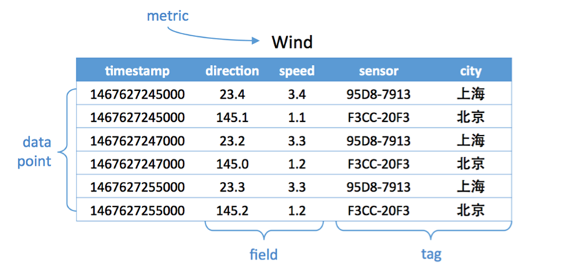
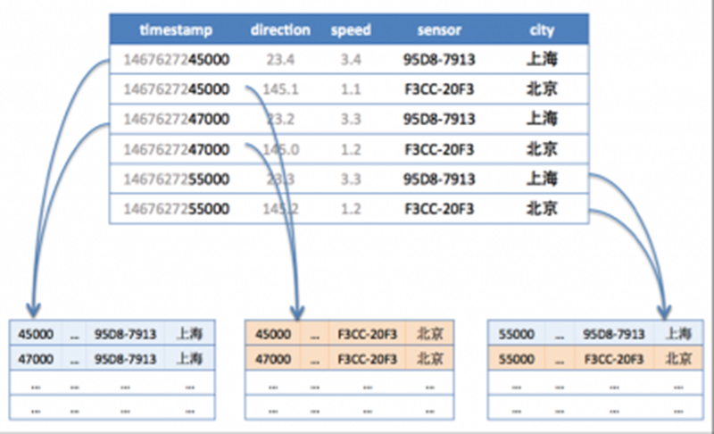

### 一、时序数据库的基本概念
1. 什么是时序数据？  
    时序数据是基于时间的一系列的数据。在有时间的坐标中将这些数据点连成线，
   往过去看，可以做成多维度报表，可以揭示其趋势性、规律性、异常性。--总结规律  
   往未来看，可以做大数据分析、机器学习，以实现预测和预警。--预测趋势、前景  
   
2. 什么是时序数据库？  
    是存放时序数据的数据库，并且需要支持时序数据的快速写入、持久化、多纬度聚合查询等基本功能。  
   > 传统数据库仅仅记录了数据的当前值，时序数据库记录了所有的历史数据。同时，时序数据的查询特点是：总是会带上时间作为过滤条件。
   
3. 时序数据库的基本概念（ps：不同的时序数据库的基本该你那称呼略有不同）  
- metric：度量，相当于关系型数据库中的table。  
- data point：数据点，相当于关系数据库中的row。  
- timestamp：时间戳，代表数据点产生的时间。  
- field：度量下的不同字段。比如位置这个度量具有经度和纬度连个field。一般情况下，field存放的是会随着时间戳的变化而变化的数据。  
- tag：标签（或者附加信息）。一般存放的是并不随时间戳变化的属性信息。  
> ps：timestamp加上所有的tags可以认为是table的primary key。  

eg.
  

### 二、时序数据库的适用场景  
适用于：
- 有时序数据产生的，   
- 并且需要展现其历史趋势、周期规律、异常性的，  
- 需要进一步对未来做出预测分析的场景。  
> ps：时序数据库是为解决海量数据场景而设计的。  

### 三、时序数据库遇到的挑战  
- 时序数据的写入。  --如何支持每秒上千万、上亿数据点的写入。  
- 时序数据的读取。  --如何支持在秒级对上亿数据的分组聚合运算。  
- 成本敏感。 --海量数据带来的成本问题。如何更低成本地存储这些数据，将成为时序数据库
需要解决的重中之重。  
  
### 四、时序数据库的数据存储  
####4.1 单机存储  
> 传统数据库采用的是B-Tree，是由于它的组织形式在查找和顺序插入时有利于减少寻道次数。  
> 众所周知，磁盘寻道的时间是非常慢的，一般在10ms左右。--磁盘的随机读写慢就慢在寻道上。  
> 所以，随机写入B-Tree会消耗大量的时间在磁盘寻道上，导致速度很慢。   --SSD虽然具有更快的寻道时间，但并没有从根本上解决这个这个问题。  

目前，业界主流都是采用LSM-Tree替换B-Tree。（eg. HBase、Cassandra等Nosql）  
LSM-Tree包括两部分：  
- 内存里的数据结构。  
- 磁盘上的文件。  
> ps：分别对应HBase里的MemStore和HLog，Cassandra里的MemTable和sstable。  

> LSM-Tree操作流程：
> 1. 数据写入和更新时，首先写入位于内存里的数据结构。当然，为了避免数据丢失，也会先写入WAL文件中。  
> 2. 内存里的数据结构会定时或者在其大小达到阈值时刷到磁盘。这些磁盘上的文件不会被修改。  
> 3. 随着磁盘上积累的文件越来越多，会定时地进行合并操作，消除冗余数据、减少文件数量。  
> eg.如下图：
   

> 可以看出，LSM-Tree的核心思想是通过内存写和后续磁盘的顺序写入来获得更高的写入性能。 --避免随机写入。  
> 但同时也牺牲了读取性能。  --因为，同一个key的值可能存在于多个HFile中。  
> 为了获得更好的读取性能，可以通过bloom filter和compaction得到。

#### 4.2 分布式存储  
    海量数据必然就要寻求分布式存储，最终落到分片问题上。  
   分片问题分为：分片方法的选择 + 分片设计
  
##### 4.2.1 分片方法  
时序数据库的分片方法与其他分布式系统是相通的。目前，主流的分片方法如下：  
- 哈希分片。 --特点：实现简单、均衡性好，但集群不易扩展。  
- 一致性哈希。    --特点：均衡性好、集群易扩展，但实现复杂。（代表有：DynamoDB和开源的Cassandra）  
- 范围划分。 --特点：通常配合全局有序，复杂度在于合并和分裂。（代表有HBase）  

##### 4.2.2 分片设计  
分片设计简单来说的就是以什么做分片（即对谁使用分片方法），这是非常有技巧的，会直接影响写入、读取的性能。  
具体：
- 先根据metric+tags分片。  --目的：相同metric+tags的数据会分配到一台机器上连续存放，顺序地磁盘读取是很快的。结合前文关于单机存储的内容，这样可以做到快速查询。  
- 如果时序数据时间范围很长，则需要再根据时间范围进行分段，分别存储在不同的机器上，这样，
对于大范围时序数据就可以支持并发查询，从而优化查询速度。  
  eg. 如下图：
  

   
  

附：
参考阅读：https://www.sohu.com/a/237660940_130419  
