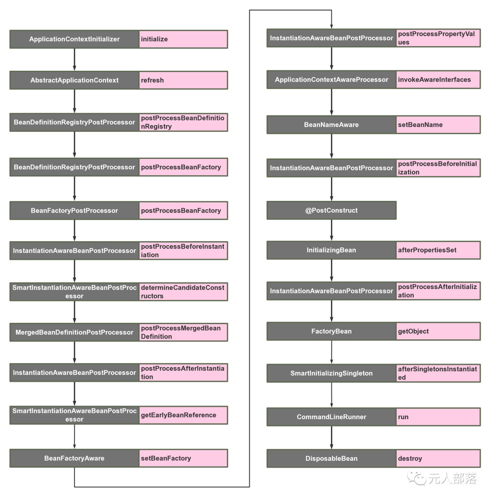

> 参考阅读：https://mp.weixin.qq.com/s/vc3GYcF4ldRYhUnfWovOtg  
  

### 项目启动过程中，扩展点调用顺序：  
- 阶段1：Spring容器初始化及beanDefinition读取完成过程中的可扩展点：  
  step1：ApplicationContextInitializer.initializer();    //参看：[ApplicationContextInitializer](./Bean生命周期内扩展点-22/ApplicationContextInitializer.md)  
  step2：AbstractApplicationContext.refresh();   //参看：[AbstractApplicationContext](./Bean生命周期内扩展点-22/AbstractApplicationContext.md)  
  step3：BeanDefinitionRegistryPostProcessor.postProcessBeanDefinitionRegistry();    //参看：[BeanDefinitionRegistryPostProcessor](./Bean生命周期内扩展点-22/BeanDefinitionRegistryPostProcessor.md)  
  step4：BeanDefinitionRegistryPostProcessor.postProcessBeanFactory();  
  step5：BeanFactoryPostProcessor.postProcessBeanFactory();  //参看：[BeanFactoryPostProcessor](./Bean生命周期内扩展点-22/BeanFactoryPostProcessor.md)  

- 阶段2：Bean实例化过程中的可扩展点：
  step1：SmartInstantiationAwareBeanPostProcessor.predictBeanType(); //参看：[SmartInstantiationAwareBeanPostProcessor](./Bean生命周期内扩展点-22/SmartInstantiationAwareBeanPostProcessor.md)  
  step2：InstantiationAwareBeanPostProcessor.postProcessBeforeInstantiation();   //参看：[InstantiationAwareBeanPostProcessor](./Bean生命周期内扩展点-22/InstantiationAwareBeanPostProcessor.md)  
  step3：SmartInstantiationAwareBeanPostProcessor.determineCandidateConstructors();  
  step4：MergedBeanDefinitionPostProcessor.postProcessMergedBeanDefinition();   //参看：[MergedBeanDefinitionPostProcessor](./Bean生命周期内扩展点-22/MergedBeanDefinitionPostProcessor.md)  
  step5：InstantiationAwareBeanPostProcessor.postProcessAfterInstantiation();  
  step6：SmartInstantiationAwareBeanPostProcessor.getEarlyBeanReference();

- 阶段3：bean实例属性注入阶段(代称吧，代指介于对象实例化与初始化中间点过渡阶段)可扩展点：  
  step1：BeanFactoryAware.setBeanFactory();   //参看：[BeanFactoryAware](./Bean生命周期内扩展点-22/BeanFactoryAware.md)  
  step2：InstantiationAwareBeanPostProcessor.postProcessProperties();  
  step3：ApplicationContextAwareProcessor.invokeAwareInterfaces();方法内6个扩展点。  //参考：[ApplicationContextAwareProcessor](./Bean生命周期内扩展点-22/ApplicationContextAwareProcessor.md)  
  step4：BeanNameAware.setBeanName();  //参考：[BeanNameAware](./Bean生命周期内扩展点-22/BeanNameAware.md)  
  
- 阶段4：bean初始化阶段可扩展点：  
  step1：InstantiationAwareBeanPostProcessor.postProcessBeforeInitialization();
  step2：@PostConstruct    //参考：[@PostConstruct.md](./Bean生命周期内扩展点-22/@PostConstruct.md)  
  step3：InitializingBean.afterPropertiesSet();  //参考：[InitializingBean](./Bean生命周期内扩展点-22/InitializingBean.md)  
  step4：InstantiationAwareBeanPostProcessor.postProcessAfterInitialization();  
  step5：FactoryBean.getObject();  //参考：[FactoryBean](./Bean生命周期内扩展点-22/FactoryBean.md)  
  step6：SmartInitializingSingleton.afterSingletonsInstantiated();   //参考：[SmartInitializingSingleton](./Bean生命周期内扩展点-22/SmartInitializingSingleton.md)  
  
### 项目启动完成后，bean使用过程中扩展点：  
1. CommandLineRunner.run();   //参考：[CommandLineRunner](./Bean生命周期内扩展点-22/CommandLineRunner.md)  
2. DisposableBean.destroy();  //参考：[DisposableBean](./Bean生命周期内扩展点-22/DisposableBean.md)  
      或者：@PreDestroy    //参看：[J2EE-@PostConstruct与@PreDestroy.md](注解/J2EE-@PostConstruct与@PreDestroy.md)   
3. ApplicationListener  //参看：[ApplicationListener](./Bean生命周期内扩展点-22/ApplicationListener.md)  

  
  