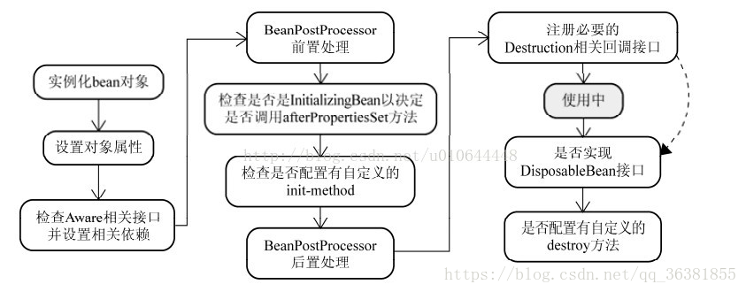
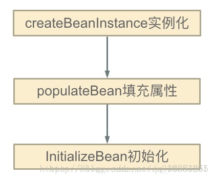

### 一、Spring 中循环依赖的两种场景  
1. 场景一：构造器循环依赖  
2. 场景二：Setter 注入循环依赖  
> ps：Spring 无法解决“构造器循环依赖”场景。  



> 图中前两步骤得知：Spring是先将Bean对象实例化【依赖无参构造函数】--->再(通过Setter方法)设置对象属性的

### 二、Spring 如何解决循环依赖  
#### 2.1 原理：
当我们获取到对象的引用时，对象的field是可以延后设置的(但是构造器必须是在获取引用之前)。Spring采用如下策略：
Spring 将单例对象的初始化主要分为三步：
  
> 1.createBeanInstance：实例化，其实也就是 调用对象的构造方法实例化对象  
> 2.populateBean：填充属性，这一步主要是多bean的依赖属性进行填充  
> 3.initializeBean：调用spring xml中的init() 方法。

从上面讲述的单例bean初始化步骤我们可以知道，循环依赖主要发生在第一、第二步。也就是构造器循环依赖和field循环依赖。
那么我们要解决循环引用也应该从初始化过程着手，对于单例来说，在Spring容器整个生命周期内，有且只有一个对象，所以很容易想到这个对象应该存在Cache中，Spring为了解决单例的循环依赖问题，使用了三级缓存。
调整配置文件，将构造函数注入方式改为 属性注入方式 即可

2.2 Spring 源码使用三级缓存：
```java
    //第一级缓存：singletonObjects：单例对象的cache
    private final Map<String, Object> singletonObjects = new ConcurrentHashMap(256);

    //第三级缓存：singletonFactories ： 单例对象工厂的cache
    private final Map<String, ObjectFactory<?>> singletonFactories = new HashMap(16);

    //第二级缓存：earlySingletonObjects ：提前暴光的单例对象的Cache 。【用于检测循环引用，与singletonFactories互斥】
    private final Map<String, Object> earlySingletonObjects = new HashMap(16);
```
源码：
```java
    protected Object getSingleton(String beanName, boolean allowEarlyReference) {
        Object singletonObject = this.singletonObjects.get(beanName);
        if (singletonObject == null && this.isSingletonCurrentlyInCreation(beanName)) {
            synchronized(this.singletonObjects) {
                singletonObject = this.earlySingletonObjects.get(beanName);
                if (singletonObject == null && allowEarlyReference) {
                    ObjectFactory<?> singletonFactory = (ObjectFactory)this.singletonFactories.get(beanName);
                    if (singletonFactory != null) {
                        singletonObject = singletonFactory.getObject();
                        this.earlySingletonObjects.put(beanName, singletonObject);
                        this.singletonFactories.remove(beanName);
                    }
                }
            }
        }

        return singletonObject != NULL_OBJECT ? singletonObject : null;
    }
```

> 参考阅读：https://blog.csdn.net/qq_36381855/article/details/79752689  
> 