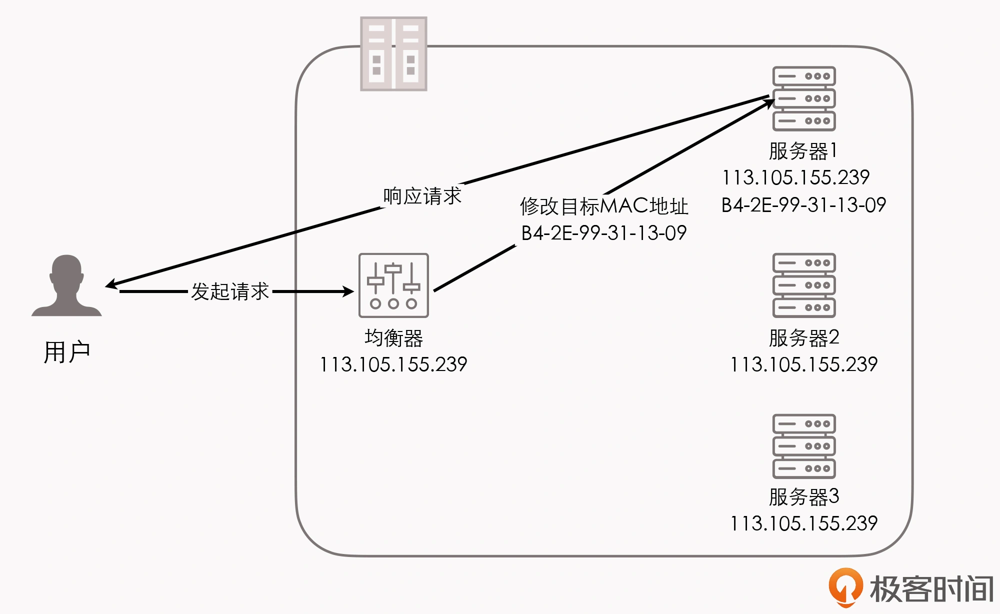
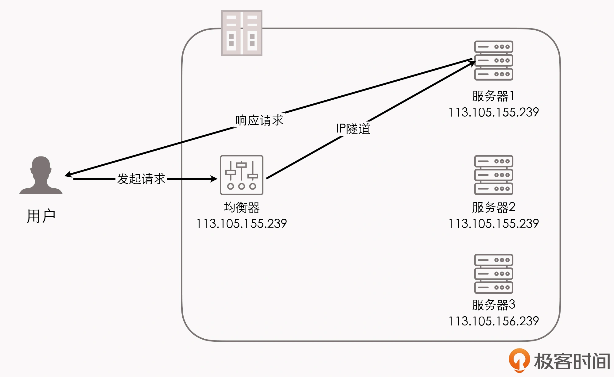
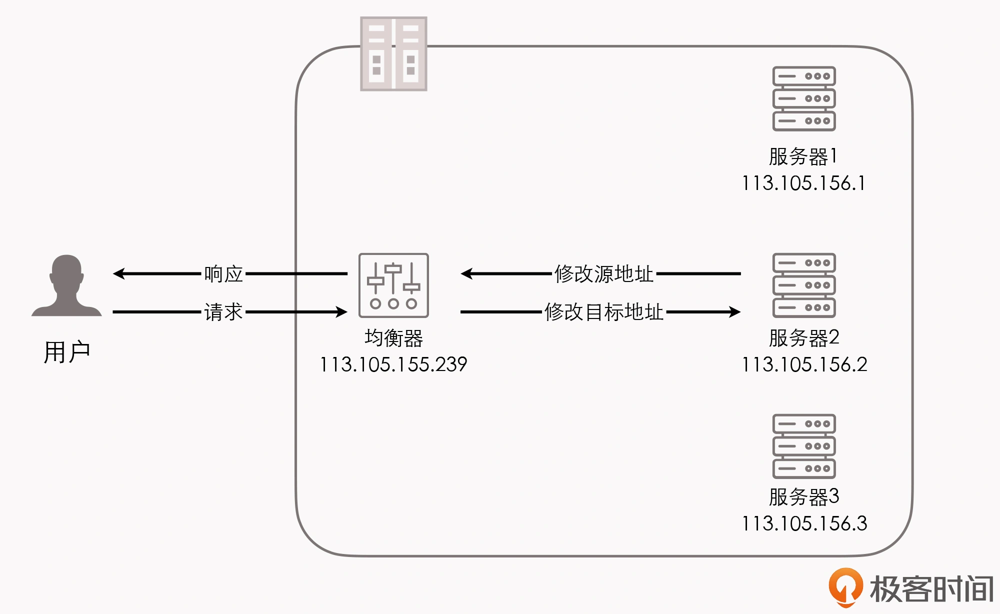
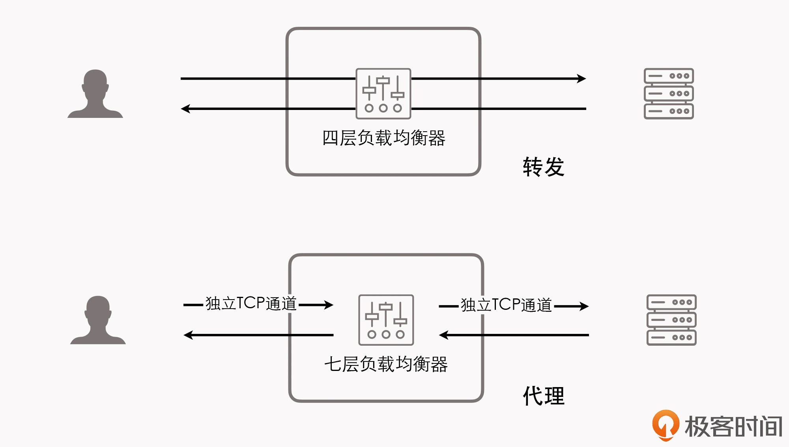

负载均衡两大职责：  
- ”选择谁来处理用户请求“  
- ”将用户请求转发过去“  

### 一、负载均衡的两种形式：
1. 四层负载均衡  
  > 这里的“四层”的意思是：这些工作模式的共同特点是都维持着同一个TCP连接，而不是说它就只工作在第四层。  
  > 事实上，这些某事主要都是工作在（第）二层（数据链路层--可以改写MAC地址）以及（第）三层（网络层--可以改
  > 写IP地址）。而单纯只处理第四层（传输层--可以改写TCP、UDP等协议的内容和端口）的数据无法
  > 做到负载均衡的转发，因为OSI的下三层是媒体层（Media Layers）、上四层是主机层（Host Layers）,
  > 所以，既然流量都已经到达目标主机上了，也就谈不上什么流量转发，最多只能做代理了。  
2. 七层负载均衡  
> 需建立总体的、概念性的印象：  
> 1.四层负载均衡优势-性能高，七层负载均衡优势-功能强；  
> 2.做多级混合负载均衡，通常应该是低层的负载均衡在前，高层的负载均衡在后。  

### 二、常见的四层负载均衡的工作模式  
下面将介绍两种常见的四层负载均衡的工作模式，
> ps：这两种工作模式都属于“转发”，即：直接将承载着TCP报文的底层数据格式（IP数据包或以太帧）转发到真实服务器上，
> 此时客户端到响应请求的真实服务器间维持着同一条TCP通道。  
#### 2.1 数据链路层负载均衡  
传输单位：数据帧  
数据链路层负载均衡的工作模式（亦形象地被成为“三角传输模式”）是：只有请求会经过负载均衡器，而服务的响应
不需要经负载均衡器原路返回，整个请求、转发、响应的链路形成一个“三角关系”，即：三角传输模式（Direct Server Return, DSR）,
也有人称其为“单臂模式”（Sigle Legged Mode）或“直接路由”（Direct Routing）。  

- 特点：使用这种负载均衡模式时，需要把真实物理服务器集群所有机器的虚拟IP地址（Virtual IP Address，VIP）配置成跟
  负载均衡器的虚拟IP一样，这样经负载均衡器转发后的数据包就能在真实服务器中顺利地使用。  
- 优点：效率高度（由于实际处理请求的真实物理服务器IP和数据请求中的目的IP是一致的）  
- 缺点：不能跨子网（因为这种二层负载均衡器直接改写目标MAC地址的工作原理，决定了它与真实服务器的通讯必须是
  二层可达的。简而言之，就是负载均衡器与真实物理服务器必须位于同一个子网当中，无法跨 VLAN）。  

> 上述优势及劣势就共同决定了：数据链路层负载均衡最适合用来做数据中心的第一级均衡设备，用来连接其他的下级负载
> 均衡器。
> 

#### 2.2 网路层负载均衡  
传输单位：分组数据包（Packets）  
> ps：分组数据包是一种在分组交换网络（Packet Switching Network，PSN）中传输的结构化数据单位。  

原理：通过改变分组数据包中的IP地址，来实现数据包的转发。  
具体有两种常见的修改方式：  
1. IP隧道（IP Tunnel）转发模式。 --即：保持原来的数据包不变，新创建一个数据包，把原来的数据包的Headers和Payload整体作为另一个
  新的数据包的Payload，在这个数据包的Headers中写入真实服务器的IP作为目标地址，然后把它转发出去。俗称“套娃式”。  
> 特点：由于并未改变原有数据包中的任何信息，所以IP隧道的转发模式仍然具备三角传输的特性。  
> 优点：由于IP隧道工作在网路层，所以可以跨越VLAN，因此摆脱了前面直接路由模式中网络侧的约束。  
> 缺点：1.要求真实服务器必须得支持“IP隧道协议”（IP Encapsulation），即：它得学会自己拆包人掉一层Headers。（目前几乎所有的Linux系统都支持
> IP隧道协议）。2.这种模式仍然必须通过专门的配置，必须保证所有的真实服务器与负载均衡器有着相同的虚拟IP地址。一方面，这与“透明”的原则冲突了，需要
> 系统管理员去专门介入。另一方面，并不是在任何情况下我们都可以对服务器进行虚拟IP的配置的，尤其是当有好几个服务用用一台物理服务器的时候。  

2. NAT（Network Address Translation）转发模式。 --改变目标数据包的方式，即：直接把数据包的Header中的目标地址改掉，修改后，
   原本由用户发给均衡器的数据包，也会被三层交换机转发到真实服务器的网卡上。这种方式没有经过IP隧道的额外包装，因而无需再拆包。  
   > 均衡器工作：1.将请求包的目标IP改为真实服务器的IP；2.将应答包的源IP改为自己的IP。
   > 特点：负载均衡器代表整个服务集群来进行应答。（各个服务器的响应数据都会争抢均衡器的出口带宽）
   > 优势：运维起来十分简单，只要真实服务器将自己的网关地址设置为负载均衡器的地址即可。  
   > 劣势：因应答流量不得不回到均衡器，所以，再流量压力比较大的时候，NAT模式的负载均衡会带来较大的性能损失，比起直接路由模式和IP隧道模式，
   > 甚至会出现数量级上的下降。  
   > 
   
>> ps：还有一种更彻底的NAT模式，就是均衡器在转发时，不仅修改了请求包的目标IP（为真实服务器IP地址），而且修改了请求包的源IP也（为均衡器IP地址）了。
>> 这种方式被叫做SNAT（Source NAT）。  
>> 优点：运维更方便，连真实服务器的网关都不需要配置。  
>> 缺点：由于做了SNAT，导致真实服务器在处理请求时无法拿到客户端的IP（在真实服务器看来，所有流量均来自负载均衡器）。  

### 三、七层负载均衡工作模式--应用层负载均衡  
#### 3.1 七层负载均衡器的特点  
上面介绍的两种四层负载均衡工作模式都属于转发，但工作在四层之后的负载均衡模式就无法进行转发了，只能进行代理。
与转发只维持同一条TCP通道不同，在代理工作模式下，正式服务器、负载均衡器、客户端三者之间，是由两条独立的TCP通道来维持通讯的。  

根据”哪一方感知到的原则“，代理可分为以下三类：  
1. 正向代理--即（通常简称的代理）配置在客户端一侧的代理服务，它代表客户端来与服务器进行通讯。它是客户端可知，而对服务器透明的。  
2. 反向代理--配置在服务器一侧的代理服务，代表真实服务器来与客户端进行通讯。它是服务器端可知，而对客户端透明的。  
3. 透明代理--配置在网路中间设备上的代理服务的。它对c、s双方都是透明的。（eg.架设在路由器上的透明翻墙代理）  

可见，七层负载均衡器属于反向代理中的一种。  
> 单论网路性能，七层负载均衡器肯定干不过四层负载均衡器：  
> - 多一轮 TCP 握手。  
> - 有这着（与 NAT 转发模式一样的）带宽问题。  
> - 通常要耗费更多的 CPU，因为可用的解析规则远比四层丰富。  
>> 但是，如果网站的性能瓶颈并不在网络性能，而是要论整个服务集群对外所体现出来的服务性能，七层负载均衡器就有它的用武之地了。  
>> 这里，七层负载均衡器的底气就来源于，它是工作在应用层的，可以感知应用层通讯的具体内容，往往能够做出更明智的决策，玩出更多的花样来。  

#### 3.2 七层负载均衡器的适用场景  
1. 可以做缓存方面的工作。--eg.静态资源缓存、协议升级、安全防护、访问控制等。  
2. 可以实现更智能化的路由。eg:  
    - 根据 Session 路由，以实现亲和性的集群。  
    - 根据 URL 路由，实现专职化服务（相当于网关的职责）。  
    - 根据用户身份路由，实现部分用户的特殊服务（如某些站点的贵宾服务器）。  
    
3. 抵御某些安全攻击。eg:  
    - 以 SYN Flood 作为攻击手段的 DDos。（七层负载均衡器能感知到四层负载均衡器无法感知的上层协议内容，从而过滤掉这些SYN攻击，不会影响后面服务器的正常运行）  
    - 通过在七层负载均衡器上设定多种策略（如过滤特定报文），以防御如 SQL 注入等应用层面的特定攻击手段。  
    
4. 微服务系统中的链路治理措施。eg.服务降级、熔断、异常注入等。  

### 四、均衡策略与实现  
实现”选择谁来处理用户请求“的职责。  
1. 轮询（Round Robin）--适用于服务器组中的所有服务器都有相同的软硬件配置，并且平均服务请求相对均衡的情况。  
2. 权重轮询（Weighted Round Robin）--根据服务器的不同处理能力，给每个服务器分配不同的权值，使其能够接受相应权值数的服务请求。  
3. 随机（Random）--在数据足够大的场景下，能达到相对均衡的分布。  
4. 权重随机（Weighted Random）--类似权重轮询算法，只是在处理请求分担的时候是个随机选择的过程（理解参考：https://zhibo.blog.csdn.net/article/details/90271879?utm_medium=distribute.pc_relevant.none-task-blog-2%7Edefault%7EBlogCommendFromMachineLearnPai2%7Edefault-1.baidujs&depth_1-utm_source=distribute.pc_relevant.none-task-blog-2%7Edefault%7EBlogCommendFromMachineLearnPai2%7Edefault-1.baidujs）  
5. 一致性哈希（Consistency Hash）--根据请求中的某些数据作为特征值，来计算请求要落到哪些节点上。算法一般会保证同一个特征值每次
   都一定落在相同的服务器上。（这里的一致性的意思是：保证当服务集群的某个真实服务器出现故障的时候，只影响该服务器的哈希，而不会导致
   整个服务集群的哈希健值都重新分布）  
   
6. (最快)响应速度均衡（Response Time）  
> 即：负载均衡设备对内部各服务器发出一个探测请求（eg.Ping）,然后根据内部中各服务器对探测请求的最快响应时间来决定哪一台服务器来响应客户端的服务请求。  
> 这种均衡算法能比较好地反映服务器的当前运行状态。  
> 但要注意，这里的最快响应时间，仅仅指的是负载均衡设备与服务器间的最快响应时间，而不是客户端与服务器间的最快响应时间。  

7. 最少连接数均衡（Least Connection）  
> 会对内部中需要负载的每一台服务器都有一个数据记录（即：记录当前服务器正在处理的连接数量），当有新的服务连接请求时，就把当前请求分配给连接数最少的服务器，
> 是均衡更加符合实际情况。  
> 此算法适合长时间处理的请求服务（eg.FTP 传输）。  

### 五、负载均衡器分类  
从实现角度来看，负载均衡器的实现分为两类：  
1. 软件均衡器  
   > 软件均衡器又分为：  
   > - 直接建设在操作系统内核的均衡器，eg. LVS（Linux Virtual Server）  
   > - 应用程序形式的均衡器，eg. Nginx、HAProxy、KeepAlived  
   >> 前者性能会更好，因为它不需要在内核空间和应用空间来回复制数据包。  
   >> 而后者的优势是：选择广泛，使用方便，功能不受限于内核版本。  
2. 硬件均衡器  
    往往会直接采用”应用专用集成电路“（Application Specific Integrated Circuit, ASIC）来实现。  
    因为它有专用处理芯片的支持，可以避免操作系统层面的损耗，从而能够达到最高的性能。  
    eg. F5 及 A10 公司的负载均衡产品。  

