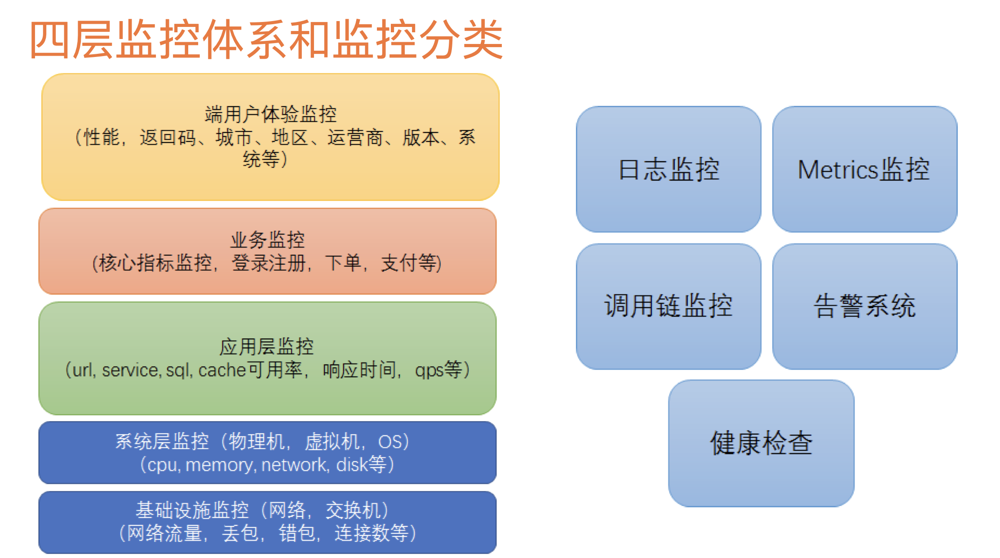
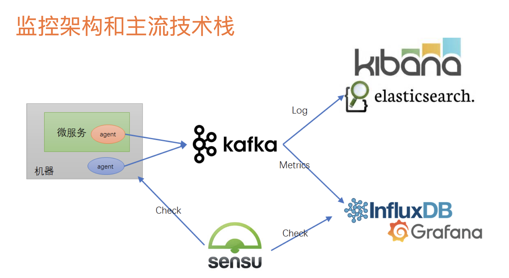

### 微服务监控系统分层与监控架构  
1. 端用户体验监控  
> 性能、返回码、城市、地区、运营商、版本、系统等。  

2. 业务监控  
> 核心指标监控、登陆注册、下单、支付等。  

3. 应用层监控  
> url、service、sql、cache命中率、相应时间、qps等。  

4. 系统监控（物理机、虚拟机、操作系统os）  
> cpu、memory、network、disk等。  

5. 基础设施监控（网络、交换机）  
> 网络流量、丢包、错包、连接数等。  

  
ps：Springboot Actuator提供健康检查api  

  
ps：Nagio也是目前主流的开源健康检查监控。  
